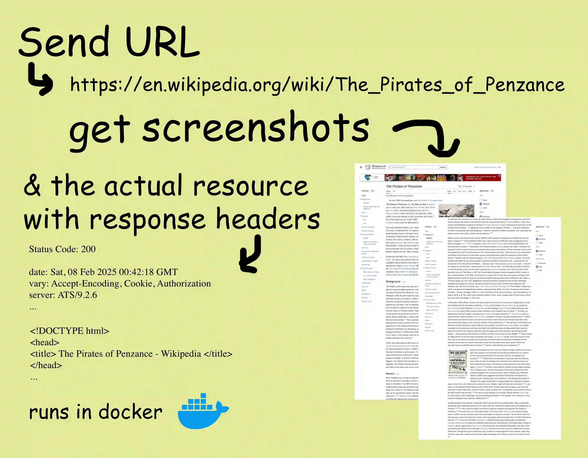

# ScrapeServ: Simple URL to screenshots server

You run the API as a web server on your machine, you send it a URL, and you get back the website data as a file plus screenshots of the site. Simple as.

<br/>
<div align="center" style="display:flex;justify-content:center;margin: 2rem 0px;">

</div>
<br/>

This project was made to support [Abbey](https://github.com/goodreasonai/abbey), an AI platform. Its author is [Gordon Kamer](https://x.com/gkamer8).

Some highlights:
- Scrolls through the page and takes screenshots of different sections
- Runs in a docker container
- Browser-based (will run websites' Javascript)
- Gives you the HTTP status code and headers from the first request
- Automatically handles 302 redirects
- Handles download links properly
- Tasks are processed in a queue with configurable memory allocation
- Blocking API
- Zero state or other complexity

This web scraper is resource intensive but higher quality than many alternatives. Websites are scraped using Playwright, which launches a Firefox browser context for each job.

## Setup

You should have Docker and `docker compose` installed.

1. Clone this repo
2. Run `docker compose up` (a `docker-compose.yml` file is provided for your use)

...and the service will be available at `http://localhost:5006`. See the Usage section below for details on how to interact with it.

## Usage

### From Your App

**Look in [client](client/README.md) for a full reference client implementation in Python.** Just send an HTTP request and process the response according to the [API reference](#api-reference) below.

### From the Command Line on Mac/Linux

You can use cURL and ripmime to interact with the API from the command line. Ripmime processes the `multipart/mixed` HTTP response and puts the downloaded files into a folder. Install [ripmime](https://pldaniels.com/ripmime/) using `brew install ripmime` on Mac or `apt-get install ripmime` on Linux. Then, paste this into your terminal:

```
curl -i -s -X POST "http://localhost:5006/scrape" \
    -H "Content-Type: application/json" \
    -d '{"url": "https://goodreason.ai"}' \
    | ripmime -i - -d outfolder --formdata --no-nameless
```

...replacing the URL and output folder name appropriately.

### API Reference

Path `/`: The root path returns status 200, plus some text to let you know the server's running if you visit the server in a web browser.

Path `/scrape`: Accepts a JSON formatted POST request and returns a `multipart/mixed` response including the resource file, screenshots, and request header information.

JSON formatted arguments:
- `url`: the URL to scrape

You can provide the desired output image format as an Accept header MIME type. If no Accept header is provided (or if the Accept header is `*/*` or `image/*`), the screenshots are returned by default as JPEGs. The following values are supported:
- image/webp
- image/png
- image/jpeg

Every response from `/scrape` will be either:

- Status 200: `multipart/mixed` response where: the first part is of type `application/json` with information about the request (includes `status`, `headers`, and `metadata`); the second part is the website data (usually `text/html`); and the remaining parts are up to 5 screenshots. Each part contains `Content-Type` and `Content-Disposition` headers, from which you can infer their file formats.
- Not status 200: `application/json` response with an error message under the "error" key

Refer to the [client](client) for a full reference implementation, which shows you how to call the API and save the files it sends back. You can also save the returned files from the [command line](#from-the-command-line-on-maclinux).

## Security Considerations

Navigating to untrusted websites is a serious security issue. Risks are somewhat mitigated in the following ways:

- Runs as isolated container (container isolation)
- Each website is scraped in a new browser context (process isolation)
- Strict memory limits and timeouts for each task
- Checks the URL to make sure that it's not too weird (loopback, local, non http, etc.)

You may take additional precautions depending on your needs, like:

- Only giving the API trusted URLs (or otherwise screening URLs)
- Running this API on isolated VMs (hardware isolation)
- Using one API instance per user
- Not making any secret files or keys available inside the container (besides the API key for the scraper itself)

**If you'd like to make sure that this API is up to your security standards, please examine the code and open issues! It's not a big repo.**

### API Keys

If your scrape server is publicly accessible over the internet, you should set an API key using a `.env` file inside the `/scraper` folder (same level as `app.py`).

You can set as many API keys as you'd like; allowed API keys are those that start with `SCRAPER_API_KEY`. For example, here is a `.env` file that has three available keys:

```
SCRAPER_API_KEY=should-be-secret
SCRAPER_API_KEY_OTHER=can-also-be-used
SCRAPER_API_KEY_3=works-too
```

API keys are sent to the service using the Authorization Bearer scheme.

## Other Configuration

You can control memory limits and other variables at the top of `scraper/worker.py`. Here are the defaults:

```
MEM_LIMIT_MB = 4_000  # 4 GB memory threshold for child scraping process
MAX_SCREENSHOTS = 5
SCREENSHOT_QUALITY = 85
BROWSER_HEIGHT = 2000
BROWSER_WIDTH = 1280
USER_AGENT = "Mozilla/5.0 (compatible; Abbey/1.0; +https://github.com/US-Artificial-Intelligence/scraper)"
```
